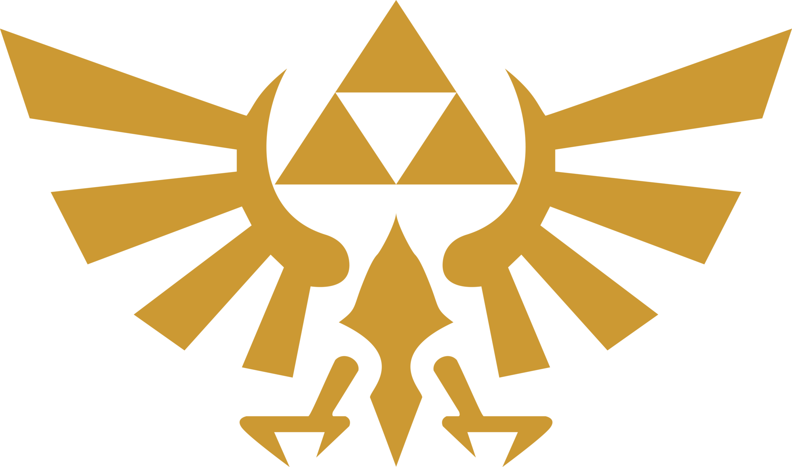

# Documentación del Proyecto - The Legend of Zelda Fan Site

## Índice
### 1. [Descripción General](#Descripcion-General)
### 2. [Estructura del Proyecto](#Estructura-del-Proyecto)
### 3. [Páginas HTML](#Paginas-HTML)
### 4. [Estilos CSS](#Estilos-CSS)
### 5. [Funcionalidades JavaScript](#Funcionalidades-JavaScript)
### 6. [Características Responsive](#Caracteristicas-Responsive)
### 7. [Componentes Reutilizables](#Componentes-Reutilizables)
### 8. [Mejores Prácticas Implementadas](#Mejores-Practicas-Implementadas)
### 9. [Resumen de Funcionalidades](#Resumen-de-Funcionalidaes)
### 10. [Conlcusión](#Conclusion)
### 11. [Links](#Repositorio-en-GitHub)

-------
## Descripción General

Este proyecto es un sitio web dedicado a The Legend of Zelda, una de las franquicias más icónicas de videojuegos. El sitio permite a los usuarios explorar información sobre juegos, personajes, historia de la saga y una galería de imágenes.

### Tecnologías Utilizadas

- HTML5: Estructura semántica del contenido
- Tailwind CSS 4: Framework de utilidades CSS para el diseño
- CSS Vanilla: Estilos personalizados y animaciones
- JavaScript ES6+: Interactividad y carga dinámica de contenido

### Paleta de Colores

- **#35C18C** - Verde principal (botones primarios)
- **#B89F64** - Dorado (títulos, acentos)
- **#393939** - Gris oscuro (texto principal)
- **#929292** - Gris medio (bordes, navegación activa)
- **#EEEEEE** - Gris claro (fondo)


-----
## Estructura del Proyecto

```
proyecto-zelda/
├── index.html              # Página principal
├── personajes.html         # Página de personajes
├── videojuegos.html        # Página de videojuegos
├── galeria.html           # Galería de imágenes
├── acerca-de.html         # Página "Acerca de"
├── login-form.html        # Formulario de login (modal)
├── register-form.html     # Formulario de registro (modal)
├── styles/
│   ├── style.css          # Estilos generales
│   └── gallery.css        # Estilos de galería
├── scripts/
│   ├── main.js            # Scripts generales
│   ├── login.js           # Lógica del login
│   ├── register.js        # Lógica del registro
│   └── gallery.js         # Lógica de la galería
├── resources/
│   ├── portadas/
│   │   └── ...
│   └── ...
├── logo.png
    
```

----
## Páginas HTML
### 1. index.html - Página Principal
**Propósito:** Página de bienvenida que presenta la información principal de los juegos más destacados.

**Secciones:**
- **Header:** Logo y botones de autenticación
- **Navegación:** Links a todas las secciones
- **Hero Section:** Mensaje de bienvenida
- **Tarjetas de Juegos:** 5 juegos destacados con información y enlaces

**Características:**
- Diseño responsive con breakpoints en` sm:`, `md:`, y `lg:`
- Tarjetas con efecto hover (escala y sombra)
- Enlaces a sitios oficiales de Nintendo
- Botones de acción con transiciones suaves

``` html
<!-- Ejemplo de tarjeta de juego -->
<div class="flex flex-col w-full hover:bg-[#FFF] hover:scale-[1.02]">
    
    <h1 class="text-[#B89F64]">Título del Juego</h1>
    <p>Descripción...</p>
    <div class="flex flex-col gap-3">
        <a href="#">¡Quiero ver más!</a>
        <a href="#">Sitio Oficial</a>
    </div>
</div>
```
----

### 2. personajes.html - Personajes

**Propósito:** Mostrar los personajes principales de la saga.

**Secciones:**

- Introducción: Texto descriptivo sobre los personajes
- Grid de Tarjetas: 3 personajes principales (Zelda, Link, Ganondorf)

**Características:**

- Grid responsive: grid-cols-1 md:grid-cols-2 lg:grid-cols-3
- Tarjetas con hover effect (hover:scale-105)
- Imágenes de personajes con descripciones
- En tablet, Ganondorf ocupa 2 columnas centrado

``` html
<!-- Grid responsive -->
<div class="grid grid-cols-1 md:grid-cols-2 lg:grid-cols-3 gap-6">
    <!-- Tarjetas de personajes -->
</div>
```
----

### 3. videojuegos.html - Videojuegos
**Propósito:** Listado completo de videojuegos con información detallada.

**Secciones:**
- Lista de Juegos: Tarjetas horizontales con imagen y datos
- Botón a Galería: Link a la galería de imágenes
- Modal de Detalles: Popup con información expandida

**Características:**
- Tarjetas adaptativas: vertical en móvil, horizontal en tablet+
- Modal con banner, cover y descripción
- Sistema de carga dinámica de contenido
- Botón de cerrar con animación de rotación

```javascript
// Abrir modal con información
function openModal(gameName, platform, imageSrc, description) {
// Actualiza el contenido del modal
modalTitle.textContent = gameName;
modalDescription.textContent = description;
modal.classList.add('active');
}
```
---
### 4. galeria.html - Galería de Imágenes
**Propósito:** Galería visual de screenshots de los juegos.

**Secciones:**
- Grid de Imágenes: 9 imágenes en formato responsivo
- Lightbox: Visor de imágenes en pantalla completa
- Navegación: Flechas y contador de imágenes

**Características:**
- Grid adaptativo: 3-4 columnas en desktop, 1-2 en móvil
- Overlay con título al hacer hover
- Lightbox con navegación por teclado (← → ESC)
- Transiciones suaves entre imágenes
- Contador de posición (ej: "3 / 9")

```javascript
// Navegación del lightbox
function navigateLightbox(direction) {
currentImageIndex += direction;
// Loop circular
if (currentImageIndex < 0) {
currentImageIndex = galleryImages.length - 1;
}
// Actualizar imagen
}
```
---

### 5. acerca-de.html - Acerca de
**Propósito:** Información sobre la franquicia y el proyecto.

**Secciones:**
Hero Section: Banner con gradiente dorado
Estadísticas: 4 tarjetas con números destacados
Historia: Grid con imagen y texto
Timeline: Momentos históricos (1986-2025)
Misión/Visión/Valores: Cards con iconos
CTA: Llamado a la acción para registro

**Características:**
Hero section con fondo degradado
Stats cards con hover effect (elevar 10px)
Timeline con animación escalonada
Diseño de storytelling visual

````css
.hero-section {
background: linear-gradient(135deg, #B89F64 0%, #8B7355 100%);
}

.stat-card:hover {
transform: translateY(-10px);
}
````
---
## Estilos CSS
### style.css - Estilos Generales
### 1. Tipografía

````css
@import url('https://fonts.googleapis.com/css2?family=Nunito');
@import url('https://fonts.googleapis.com/css2?family=Cinzel');

* {
    font-family: 'Nunito', sans-serif;
}

.game-title {
    font-family: 'Cinzel', sans-serif; /* Para títulos de juegos */
    font-weight: 700;
}
````

### 2. Componentes de Tarjetas
```css
.game-card {
transition: transform 0.3s ease, box-shadow 0.3s ease;
cursor: pointer;
}

.game-card:hover {
transform: scale(1.05);
box-shadow: 0 10px 25px rgba(0, 0, 0, 0.2);
}
```

### 3. Sistema Modal

````css
.modal {
    display: none;
    position: fixed;
    background-color: rgba(0, 0, 0, 0.7);
    z-index: 1000;
}

.modal.active {
    display: flex;
    justify-content: center;
    align-items: center;
}
````

### 4. Animaciones
````css
@keyframes fadeIn {
    from { opacity: 0; }
    to { opacity: 1; }
}

@keyframes slideIn {
    from {
        transform: translateY(-50px);
        opacity: 0;
    }
    to {
        transform: translateY(0);
        opacity: 1;
    }
}

.timeline-item {
    animation: fadeInUp 0.6s ease forwards;
}
````

### 5. Botón de Cerrar (X)
````css
.close-btn::before,
.close-btn::after {
    content: '';
    position: absolute;
    width: 30px;
    height: 3px;
    background-color: #393939;
}

.close-btn::before {
    transform: translate(-50%, -50%) rotate(45deg);
}

.close-btn::after {
    transform: translate(-50%, -50%) rotate(-45deg);
}
````
---
### gallery.css - Estilos de Galería

### 1. Grid Responsive
````css
.gallery-grid {
    display: grid;
    grid-template-columns: repeat(auto-fill, minmax(350px, 1fr));
    gap: 24px;
}

@media (max-width: 768px) {
    .gallery-grid {
        grid-template-columns: repeat(auto-fill, minmax(250px, 1fr));
    }
}
````

### 2. Efectos Hover
````css
.gallery-item:hover {
    transform: translateY(-10px) scale(1.02);
    box-shadow: 0 15px 35px rgba(0, 0, 0, 0.2);
}

.gallery-item:hover img {
    transform: scale(1.15);
    filter: brightness(0.7);
}
````

### 3. Overlay con Información
````css
.gallery-overlay {
    position: absolute;
    background: linear-gradient(to top, rgba(0, 0, 0, 0.8) 0%, transparent 100%);
    opacity: 0;
    transition: opacity 0.4s ease;
}

.gallery-item:hover .gallery-overlay {
    opacity: 1;
}
````

### 4. Lightbox
````css
.lightbox {
    position: fixed;
    background-color: rgba(0, 0, 0, 0.95);
    z-index: 2000;
}

.lightbox-nav {
    position: absolute;
    background: rgba(0, 0, 0, 0.5);
    border-radius: 50%;
}

.lightbox-nav:hover {
    background: #B89F64;
    transform: translateY(-50%) scale(1.2);
}
````

### 5. Animaciones de Entrada
````css
.gallery-item {
    animation: slideUp 0.6s ease forwards;
    opacity: 0;
}

.gallery-item:nth-child(1) { animation-delay: 0.05s; }
.gallery-item:nth-child(2) { animation-delay: 0.1s; }
/* ... y así sucesivamente */
````
---
## Funcionalidades JavaScript
### login.js - Sistema de Autenticación

**Funcionalidades:**

1. Carga Dinámica del Formulario
````javascript
async function openLoginModal(event) {
    const response = await fetch('login-form.html');
    const html = await response.text();
    modalContent.innerHTML = html;
    modal.classList.add('active');
}
````

2. Validación de Formulario
````javascript
function handleLogin(event) {
    event.preventDefault();
    const email = document.getElementById('email').value;
    const password = document.getElementById('password').value;
    
    if (email && password) {
        alert('¡Inicio de sesión exitoso!');
        closeLoginModal();
    }
}
````

3. Cierre con ESC
````javascript
document.addEventListener('keydown', function(event) {
    if (event.key === 'Escape') {
        closeLoginModal();
    }
});
````
---
### register.js - Sistema de Registro
**Funcionalidades:**

1. Validación de Contraseñas
````javascript
function handleRegister(event) {
    if (password !== confirmPassword) {
        alert('Las contraseñas no coinciden');
        return;
    }
}
````

2. Verificación de Términos
````javascript
if (!terms) {
alert('Debes aceptar los términos y condiciones');
return;
}
````

3. Cambio entre Modales
````javascript
function switchToLogin() {
    closeRegisterModal();
    setTimeout(() => {
    openLoginModal();
    }, 300);
}
````
---
### main.js - Scripts Principales

**Modal de Videojuegos**

````javascript
function openModal(gameName, platform, imageSrc, description) {
    // Actualiza todos los elementos del modal
    modalTitle.textContent = gameName;
    modalCover.src = imageSrc;
    modalBanner.src = imageSrc;
    modalPlatformText.textContent = platform;
    modalDescription.textContent = description;

    modal.classList.add('active');
    document.body.style.overflow = 'hidden';
}
````
---
### gallery.js - Sistema de Galería
1. Array de Imágenes
````javascript
const galleryImages = [
   { src: 'resources/image1.jpg', title: 'Game Title' },
   // ... más imágenes
   ];
````

2. Lightbox
````javascript
function openLightbox(index) {
   const image = galleryImages[index];
   lightboxImage.src = image.src;
   lightboxCaption.textContent = image.title;
   lightboxCounter.textContent = `${index + 1} / ${galleryImages.length}`;
   lightbox.classList.add('active');
}
````

3. Navegación
````javascript
function navigateLightbox(direction) {
    currentImageIndex += direction;

    // Loop circular
    if (currentImageIndex < 0) {
        currentImageIndex = galleryImages.length - 1;
    } else if (currentImageIndex >= galleryImages.length) {
        currentImageIndex = 0;
    }

    // Actualizar con transición
    lightboxImage.style.opacity = '0';
    setTimeout(() => {
        lightboxImage.src = image.src;
        lightboxImage.style.opacity = '1';
    }, 200);
}
````

4. Controles de Teclado
````javascript
document.addEventListener('keydown', function(event) {
    if (lightbox.classList.contains('active')) {
        if (event.key === 'Escape') closeLightbox();
            else if (event.key === 'ArrowLeft') navigateLightbox(-1);
            else if (event.key === 'ArrowRight') navigateLightbox(1);
       }
    });
````
---

## Características Responsive
### Breakpoints Utilizados
````css
/* Tailwind CSS Breakpoints */
sm:  640px   /* Móviles grandes / Tablets pequeñas */
md:  768px   /* Tablets */
lg:  1024px  /* Laptops */
xl:  1280px  /* Desktop */
2xl: 1536px  /* Desktop grande */
````
### Estrategias Responsive
1.  **Header**
````html
<!-- Móvil: Columna | Desktop: Fila -->
<header class="flex flex-col md:flex-row items-center gap-4">
    <!-- Logo -->
    <div class="flex flex-col sm:flex-row gap-3">
        <!-- Botones apilados en móvil, lado a lado en tablet+ -->
    </div>
</header>
````
2. **Navegación**
````html
<!-- Scroll horizontal en móvil, fijo en desktop -->
<nav class="flex overflow-x-auto">
    <a class="text-[16px] sm:text-[18px] lg:text-[20px] 
              min-w-[80px] lg:w-[20%]">
        Link
    </a>
</nav>
````

3. **Tarjetas de Juegos**
````html
<!-- Vertical en móvil, horizontal en tablet+ -->
<div class="flex flex-col sm:flex-row items-center">
    
    <div class="text-center sm:text-left">
        <!-- Contenido -->
    </div>
</div>
````

4. **Grids**
````html
<!-- 1 columna móvil, 2 tablet, 3 desktop -->
<div class="grid grid-cols-1 md:grid-cols-2 lg:grid-cols-3 gap-6">
    <!-- Items -->
</div>
````

5. **Tamaños de Texto**
````html
<!-- Escala progresiva de tamaños -->
<h1 class="text-[24px] sm:text-[32px] lg:text-[40px]">
    Título Responsive
</h1>
````

6. **Espaciado**
````html
<!-- Padding y margin adaptativos -->
<section class="mt-12 sm:mt-24 lg:mt-[228px] px-4 sm:px-6 lg:px-8">
````

7. **Imágenes**
````html
<!-- Alturas diferentes según dispositivo -->

````
---
### Tabla de Resoluciones
| Dispositivo   | Ancho      | Breakpoint | Cambios Principales                        |
|:--------------|:-----------|:-----------|:-------------------------------------------|
| Móvil pequeño | < 480px    | base       | Columnas, textos 14-24px, padding reducido |
| Móvil grande  | 481-767px  | `sm:`      | Algunos elementos en fila, textos 18-32px  |
| Tablet        | 768-1024px | `md:`      | 2 columnas, layout híbrido                 |
| Desktop       | 1025px+    | `lg:`      | 3+ columnas, tamaños completos             |

## Componentes Reutilizables
1. **Header (Usado en todas las páginas)**
````html
<header class="flex flex-col md:flex-row items-center justify-between p-4 gap-4">
    <div class="logo">
        
    </div>
    <div class="flex flex-col sm:flex-row gap-3">
        <a href="#" onclick="openRegisterModal(event)">Registrarse</a>
        <a href="#" onclick="openLoginModal(event)">Iniciar sesión</a>
    </div>
</header>
````

2. **Navegación (Consistente en todo el sitio)**
````html
<nav class="flex items-center justify-around border-b-[5px] border-[#929292]">
    <a href="index.html">Inicio</a>
    <a href="personajes.html">Personajes</a>
    <a href="videojuegos.html">Videojuegos</a>
    <a href="acerca-de.html">Acerca de</a>
</nav>
````

3. **Footer (Idéntico en todas las páginas)**
````html
<footer class="flex flex-col justify-center items-center mt-16">
    <div class="flex flex-col sm:flex-row justify-between border-t">
        <p>Copyright © 2025 Alba Inc.</p>
        <p>México</p>
    </div>
</footer>
````

4. **Modales (Login y Registro)**
````html
<div id="loginModal" class="modal-login" onclick="closeLoginModal(event)">
    <div class="modal-content-wrapper"></div>
</div>
````

5. **Botones de Acción**
````html
<!-- Botón primario -->
<a class="bg-[#35C18C] rounded-[30px] text-[#EEEEEE] font-bold 
          hover:bg-[#2da877] transition">
    Texto del Botón
</a>

<!-- Botón secundario -->
<a class="border-2 border-[#35C18C] rounded-[30px] text-[#393939]
hover:bg-[#35C18C] hover:text-[#EEEEEE] transition">
Texto del Botón
</a>
````
---

## Mejores Prácticas Implementadas
1. **Accesibilidad**
- Atributos alt en todas las imágenes
- Etiquetas semánticas (`<header>`, `<nav>`, `<main>`, `<footer>`)
- Contraste de colores adecuado
- Navegación por teclado en modales

2. **Performance**
- Carga dinámica de formularios (lazy loading)
- Imágenes optimizadas
- CSS modular y organizado
- JavaScript separado por funcionalidad

3. **Experiencia de Usuario**
- Feedback visual en todos los elementos interactivos
- Transiciones suaves (0.3s ease)
- Estados hover claros
- Mensajes de confirmación en formularios

4. **Responsive Design**
- Mobile-first approach
- Breakpoints consistentes
- Imágenes adaptativas
- Texto escalable

5. **Código Limpio**
- Comentarios descriptivos
- Nombres de variables claros
- Separación de responsabilidades
- Reutilización de componentes
---

## Resumen de Funcionalidades
| Característica           | Páginas          | Descripción                                  |
|:-------------------------|:-----------------|:---------------------------------------------|
| Sistema de Autenticación | Todas            | Modales de login/registro con validación     |
| Diseño Responsive        | Todas            | Adaptación a móvil, tablet y desktop         |
| Navegación               | Todas            | Menú consistente con página activa destacada |
| Galería Interactiva      | galeria.html     | Lightbox con navegación y transiciones       |
| Modales de Información   | videojuegos.html | Popups con detalles de juegos                |
| Animaciones              | Todas            | Hover effects, transiciones, fadeIn/slideIn  |
| Timeline Histórico       | acerca-de.html   | Línea de tiempo con animación escalonada     |
| Cards Interactivas       | personajes.html  | Tarjetas con hover y grid responsive         |
---

## Conclusión
Este proyecto implementa un sitio web moderno, la idea fue similar el diseño del menu interactivo de una Nintendo Switch, y completamente responsive dedicado a The Legend of Zelda, utilizando las mejores prácticas de desarrollo web investigando en foros y chats de Inteligencia Artificial como Claude, Gemini o Copilot. El código está organizado de manera modular, facilitando el mantenimiento y futuras expansiones. Todas las páginas mantienen consistencia visual y funcional, proporcionando una experiencia de usuario fluida en cualquier dispositivo.

---

### Repositorio en GitHub
https://github.com/delmanu/ZeldaFanPage


### Página hosteada con GitHub Pages
https://delmanu.github.io/ZeldaFanPage/index.html

### Documento Design System de la Página
https://scene.zeplin.io/project/68fae511b49d1d73d75fb016